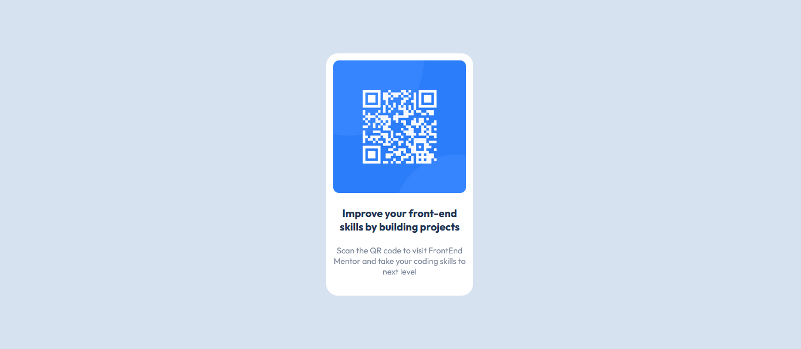

# Frontend Mentor - QR code component solution

Esta é uma solução [QR code component challenge on Frontend Mentor](https://www.frontendmentor.io/challenges/qr-code-component-iux_sIO_H).

## Índice

- [Overview](#overview)
  - [Screenshot](#screenshot)
  - [Links](#links)
- [Meu processo](#meu-processo)
  - [Tecnologias](#tecnologias)
  - [O Que Aprendi](#o-que-aprendi)
  - [O Que Fazer Agora](#o-que-fazer-agora)
  - [Link Úteis](#links-uteis)
- [Autor](#autor)

## Overview

### Screenshot

### Links

- Solution URL:(https://github.com/rialbeg/interactive-rating-component)
- Live Site URL: (https://rialbeg.github.io/interactive-rating-component/)

## Meu processo

### Tecnologias

- HTML5 Semãntico
- CSS
- Flexbox
- Mobile-first workflow

### O que aprendi

Neste projeto consolidei conhecimentos como posicionamento de elementos usando
flexbox e estilização usando css.

### O que fazer agora

Agora devo focar em praticar mais até que fique natural o desenvolvimento
de projetos desse tipo.

## Autor

- Portfolio - [Gabriel Mascarenhas](https://rialbeg.github.io/portfolio)
- Frontend Mentor - [@rialbeg](https://www.frontendmentor.io/profile/rialbeg)
- Linkedin - [@gsamascarenhas](https://www.linkedin.com/in/gsamascarenhas/)
